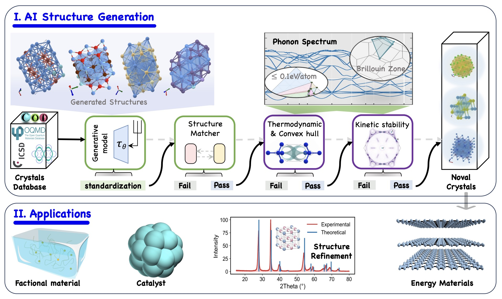
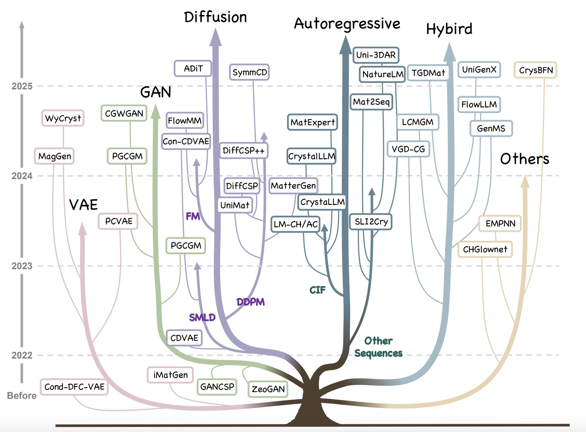

# Awesome-AI-for-Materials-Generation | [arXiv](https://arxiv.org/pdf/2505.16379)

This repository is for our paper:

> **[Materials Generation in the Era of Artificial Intelligence: A Comprehensive Survey](https://arxiv.org/pdf/2505.16379)** \
> [Zhixun Li](https://zhixunlee.github.io/)1,\*, [Bin Cao](http://www.caobin.asia/)2,\*, [Rui Jiao](https://jiaor17.github.io/)3,\*, [Liang Wang](https://azureleon1.github.io/)4,\*, [Ding Wang](https://www.wangding.site/)4, [Yang Liu](https://scholar.google.com/citations?user=IWyM6l0AAAAJ&hl=zh-CN)2, [Dingshuo Chen](https://scholar.google.com/citations?user=jvrhEfIAAAAJ&hl=zh-CN)4,
> [Jia Li](https://sites.google.com/view/lijia)2, [Qiang Liu](https://people.ucas.edu.cn/~qiangliu?language=en)4, [Yu Rong](https://royrong.me/)5, [Liang Wang](https://ia.cas.cn/rcdw/jcqn/202404/t20240422_7129880.html)4, [Tong-yi Zhang](https://facultyprofiles.hkust-gz.edu.cn/faculty-personal-page/ZHANG-Tongyi/mezhangt)2,6, [Jeffrey Xu Yu](https://www.se.cuhk.edu.hk/people/academic-staff/prof-yu-xu-jeffrey/)1 \
> 1The Chinese University of Hong Kong \
> 2Hong Kong University of Science and Technology (Guangzhou) \
> 3Tsinghua University \
> 4Institute of Automation, Chinese Academy of Sciences \
> 5DAMO Academy, Alibaba Group \
> 6Shanghai University

---
>
> 🙋 Please let us know if you find out a mistake or have any suggestions!
> 
> 🌟 If you find this resource helpful, please consider to star this repository and cite our paper!

## Deep Generative Models for Materials Design

###  Motivation

The discovery of novel materials with desired physical, chemical, or mechanical properties is a longstanding challenge in materials science. Deep generative models (DGMs) have emerged as a powerful tool to design new materials by learning underlying patterns from existing structure-property databases. This repository serves as:

* A taxonomy of DGM-based crystal generation methods.
* A comparative analysis of architectures, conditioning schemes, and model sizes.
* A collection of open datasets used for training generative models.

### Overview

This repository presents a curated and comprehensive overview of deep generative models for **crystal structure generation**. It categorizes recent methods by generation mechanism (e.g., VAE, GAN, Diffusion, and LLM), summarizes key datasets, and provides links to implementations and papers for further exploration.

---

## Model Summary

### 2025

* **[KLDM]** *Kinetic Langevin Diffusion for Crystalline Materials Generation*

* **[WyckoffDiff]** *WyckoffDiff -- A Generative Diffusion Model for Crystal Symmetry* [[Paper](https://arxiv.org/pdf/2502.06485) | [Code](https://github.com/httk/wyckoffdiff)]

* **[Wyckoff Transformer]** *Wyckoff Transformer: Generation of Symmetric Crystals* [[Paper](https://arxiv.org/pdf/2503.02407) | [Code](https://github.com/SymmetryAdvantage/WyckoffTransformer)]

* **[OMG]** *Open Materials Generation with Stochastic Interpolants* [[Paper](https://arxiv.org/pdf/2502.02582?)]

* **[Chemeleon]** *Exploration of crystal chemical space using text-guided generative artificial intelligence* [[Paper](https://www.nature.com/articles/s41467-025-59636-y) | [Code](https://github.com/hspark1212/chemeleon)]

* **[SymmCD]** *SymmCD: Symmetry-Preserving Crystal Generation with Diffusion Models* [[Paper](https://arxiv.org/pdf/2502.03638) | [Code](https://github.com/sibasmarak/SymmCD)]

* **[MatterGen]** *Mattergen: a generative model for inorganic materials design* [[Paper](https://arxiv.org/pdf/2312.03687) | [Code](https://github.com/microsoft/mattergen)]

* **[ADiT]** *All-atom Diffusion Transformers: Unified generative modelling of molecules and materials* [[Paper](https://arxiv.org/pdf/2503.03965) | [Code](https://github.com/facebookresearch/all-atom-diffusion-transformer)]

* **[DAO]** *Siamese Foundation Models for Crystal Structure Prediction* [[Paper](https://arxiv.org/pdf/2503.10471)]

* **[CrystalGRW]** *CrystalGRW: Generative Modeling of Crystal Structures with Targeted Properties via Geodesic Random Walks* [[Paper](https://arxiv.org/pdf/2501.08998) | [Code](https://github.com/trachote/crystalgrw)]

* **[NatureLM]** *NatureLM: Deciphering the Language of Nature for Scientific Discovery* [[Paper](https://arxiv.org/pdf/2502.07527) | [Code](https://naturelm.github.io/)]

* **[MatLLMSearch]** *Large Language Models Are Innate Crystal Structure Generators* [[Paper](https://arxiv.org/pdf/2502.20933) | [Code](https://github.com/JingruG/MatLLMSearch)]

* **[Uni-3DAR]** *Uni-3DAR: Unified 3D Generation and Understanding via Autoregression on Compressed Spatial Tokens* [[Paper](https://arxiv.org/pdf/2503.16278?) | [Code](https://github.com/dptech-corp/Uni-3DAR)]

* **[TGDMat]** *Periodic Materials Generation using Text-Guided Joint Diffusion Model* [[Paper](https://arxiv.org/pdf/2503.00522?) | [Code](https://github.com/kdmsit/TGDMat)]

* **[UniGenX]** *UniGenX: Unified Generation of Sequence and Structure with Autoregressive Diffusion* [[Paper](https://arxiv.org/pdf/2503.06687)]

* **[CrysBFN]** *A Periodic Bayesian Flow for Material Generation* [[Paper](https://arxiv.org/pdf/2502.02016) | [Code](https://github.com/wu-han-lin/CrysBFN)]

### 2024

* **[WyCryst]** *WyCryst: Wyckoff inorganic crystal generator framework* [[Paper](https://arxiv.org/pdf/2311.17916) | [Code](https://github.com/RaymondZhurm/WyCryst)]

* **[MagGen]** *MagGen: A graph aided deep generative model for inverse design of stable, permanent magnets* [[Paper](https://arxiv.org/pdf/2311.13328)]

* **[GAN-DDLSF]** *Crystal Structure Prediction Using Generative Adversarial Network with Data-Driven Latent Space Fusion Strategy* [[Paper](https://pubs.acs.org/doi/abs/10.1021/acs.jctc.4c01096)]

* **[NSGAN]** *NSGAN: a non-dominant sorting optimisation-based generative adversarial design framework for alloy discovery* [[Paper](https://www.nature.com/articles/s41524-024-01294-7.pdf) | [Code](https://github.com/anucecszl/NSGAN_aluminium)]

* **[DeepCSP]** *Organic crystal structure prediction via coupled generative adversarial networks and graph convolutional networks* [[Paper](https://www.cell.com/the-innovation/pdfExtended/S2666-6758(23)00190-X)]

* **[CGWGAN]** *CGWGAN: crystal generative framework based on Wyckoff generative adversarial network* [[Paper](https://www.oaepublish.com/articles/jmi.2024.24) | [Code](https://github.com/WPEM/CGWGAN)]

* **[Cond-CDVAE]** *Deep learning generative model for crystal structure prediction* [[Paper](https://www.nature.com/articles/s41524-024-01443-y.pdf) | [Code](https://github.com/ixsluo/cond-cdvae)]

* **[Con-CDVAE]** *Con-CDVAE: A method for the conditional generation of crystal structures* [[Paper](https://www.sciencedirect.com/science/article/pii/S2950463524000036) | [Code](https://github.com/cyye001/Con-CDVAE)]

* **[StructRepDiff]** *Representation-space diffusion models for generating periodic materials* [[Paper](https://arxiv.org/pdf/2408.07213)]

* **[DiffCSP++]** *Space group constrained crystal generation* [[Paper](https://arxiv.org/pdf/2402.03992) | [Code](https://github.com/jiaor17/DiffCSP-PP)]

* **[GemsDiff]** *Vector field oriented diffusion model for crystal material generation* [[Paper](https://ojs.aaai.org/index.php/AAAI/article/view/30224) | [Code](https://github.com/aklipf/gemsdiff)]

* **[EquiCSP]** *Equivariant diffusion for crystal structure prediction* [[Paper](https://openreview.net/forum?id=VRv8KjJNuj) | [Code](https://github.com/EmperorJia/EquiCSP)]

* **[FlowMM]** *Flowmm: Generating materials with riemannian flow matching* [[Paper](https://openreview.net/forum?id=W4pB7VbzZI) | [Code](https://github.com/facebookresearch/flowmm)]

* **[SuperDiff]** *Diffusion models for conditional generation of hypothetical new families of superconductors* [[Paper](https://www.nature.com/articles/s41598-024-61040-3.pdf) | [Code](https://github.com/sdkyuanpanda/SuperDiff)]

* **[MOFFlow]** *MOFFlow: Flow Matching for Structure Prediction of Metal-Organic Frameworks* [[Paper](https://arxiv.org/pdf/2410.17270) | [Code](https://github.com/nayoung10/MOFFlow)]

* **[CrystalFlow]** *Crystalflow: A flow-based generative model for crystalline materials* [[Paper](https://arxiv.org/pdf/2412.11693) | [Code](https://github.com/ixsluo/CrystalFlow)]

* **[CrystaLLM]** *Crystal structure generation with autoregressive large language modeling* [[Paper](https://www.nature.com/articles/s41467-024-54639-7.pdf) | [Code](https://github.com/lantunes/CrystaLLM)]

* **[CrystalLLM]** *Fine-tuned language models generate stable inorganic materials as text* [[Paper](https://arxiv.org/pdf/2402.04379) | [Code](https://github.com/facebookresearch/crystal-text-llm)]

* **[Mat2Seq]** *Invariant tokenization of crystalline materials for language model enabled generation* [[Paper](https://proceedings.neurips.cc/paper_files/paper/2024/file/e23133d34964a0a09f6d076fc4b922a4-Paper-Conference.pdf) | [Code](https://github.com/YKQ98/Mat2Seq)]

* **[MatExpert]** *Matexpert: Decomposing materials discovery by mimicking human experts* [[Paper](https://arxiv.org/pdf/2410.21317) | [Code](https://github.com/BangLab-UdeM-Mila/MatExpert)]

* **[FlowLLM]** *FlowLLM: Flow matching for material generation with large language models as base distributions* [[Paper](https://proceedings.neurips.cc/paper_files/paper/2024/file/51d317df78eded9eb3c9d3fb1091c279-Paper-Conference.pdf) | [Code](https://github.com/facebookresearch/flowmm)]

* **[GenMS]** *Generative hierarchical materials search* [[Paper](https://proceedings.neurips.cc/paper_files/paper/2024/file/447d012bd95b6767a4bfdebf96cdfcc9-Paper-Conference.pdf)]

* **[LCMGM]** *A deep generative modeling architecture for designing lattice-constrained perovskite materials* [[Paper](https://www.nature.com/articles/s41524-024-01381-9.pdf) | [Code](https://github.com/chenebuah/LCMGM)]

* **[VGD-CG]** *Inverse design of semiconductor materials with deep generative models* [[Paper](https://pubs.rsc.org/en/content/articlelanding/2024/ta/d4ta02872d/unauth) | [Code](https://github.com/stupidcloud/VGD-CG)]

* **[DP-CDVAE]** *Diffusion probabilistic models enhance variational autoencoder for crystal structure generative modeling* [[Paper](https://www.nature.com/articles/s41598-024-51400-4.pdf) | [Code](https://github.com/trachote/dp-cdvae)]

### 2023

* **[PCVAE]** *Pcvae: A physics-informed neural network for determining the symmetry and geometry of crystals* [[Paper](https://ieeexplore.ieee.org/abstract/document/10191051) | [Code](https://github.com/zjuKeLiu/PCVAE)]

* **[PGCGM]** *Evaluating the diversity and utility of materials proposed by generative models* [[Paper](https://arxiv.org/pdf/2309.12323) | [Code](https://github.com/MilesZhao/PGCGM)]

* **[P-CDVAE]** *Compositional Search of Stable Crystalline Structures in Multi-Component Alloys Using Generative Diffusion Models* [[Paper](https://arxiv.org/pdf/2312.16073)]

* **[LCOMs]** *Latent Conservative Objective Models for Data-Driven Crystal Structure Prediction* [[Paper](https://arxiv.org/pdf/2310.10056)]

* **[DiffCSP]** *Crystal structure prediction by joint equivariant diffusion* [[Paper](https://proceedings.neurips.cc/paper_files/paper/2023/file/38b787fc530d0b31825827e2cc306656-Paper-Conference.pdf) | [Code](https://github.com/jiaor17/DiffCSP)]

* **[UniMat]** *Scalable diffusion for materials generation* [[Paper](https://arxiv.org/pdf/2311.09235) | [Code](https://unified-Crystals.github.io/unimat/)]

* **[MOFDiff]** *Mofdiff: Coarse-grained diffusion for metal-organic framework design* [[Paper](https://arxiv.org/pdf/2310.10732) | [Code](https://github.com/microsoft/MOFDiff)]

* **[xyztransformer]** *Language models can generate molecules, materials, and protein binding sites directly in three dimensions as xyz, cif, and pdb files* [[Paper](https://arxiv.org/abs/2305.05708) | [Code](https://github.com/danielflamshep/xyztransformer)]

* **[SLI2Cry]** *An invertible, invariant crystal representation for inverse design of solid-state materials using generative deep learning* [[Paper](https://www.nature.com/articles/s41467-023-42870-7.pdf) | [Code](https://github.com/xiaohang007/SLICES)]

* **[EMPNN]** *Equivariant message passing neural network for crystal material discovery* [[Paper](https://ojs.aaai.org/index.php/AAAI/article/view/26673) | [Code](https://github.com/aklipf/pegnn)]

* **[CHGlownet]** *Hierarchical GFlownet for Crystal Structure Generation* [[Paper](https://openreview.net/pdf?id=dJuDv4MKLE)]

* **[Crystal-GFN]** *Crystal-GFN: sampling crystals with desirable properties and constraints* [[Paper](https://arxiv.org/pdf/2310.04925) | [Code](https://github.com/alexhernandezgarcia/gflownet)]

### 2022

* **[FTCP]** *An invertible crystallographic representation for general inverse design of inorganic crystals with targeted properties* [[Paper](https://www.cell.com/matter/pdfExtended/S2590-2385(21)00625-1) | [Code](https://github.com/PV-Lab/FTCP)]

### 2021

* **[CDVAE]** *Crystal diffusion variational autoencoder for periodic material generation* [[Paper](https://arxiv.org/pdf/2110.06197) | [Code](https://github.com/txie-93/cdvae)]

### Before 2021

* **[iMatGen]** *Inverse design of solid-state materials via a continuous representation* [[Paper](https://www.cell.com/matter/pdfExtended/S2590-2385(19)30175-4) | [Code](https://github.com/kaist-amsg/imatgen)]

* **[Cond-DFC-VAE]** *3-D inorganic crystal structure generation and property prediction via representation learning* [[Paper](https://pubs.acs.org/doi/pdf/10.1021/acs.jcim.0c00464) | [Code](https://github.com/by256/icsg3d)]

* **[GANCSP]** *Generative adversarial networks for crystal structure prediction* [[Paper](https://pubs.acs.org/doi/pdf/10.1021/acscentsci.0c00426) | [Code](https://github.com/kaist-amsg/Composition-Conditioned-Crystal-GAN)]

* **[CCDCGAN]** *Constrained crystals deep convolutional generative adversarial network for the inverse design of crystal structures* [[Paper](https://www.nature.com/articles/s41524-021-00526-4.pdf)]

* **[ZeoGAN]** *Inverse design of porous materials using artificial neural networks* [[Paper](https://www.science.org/doi/pdf/10.1126/sciadv.aax9324) | [Code](https://github.com/good4488/ZeoGAN)]

* **[MatGAN]** *Generative adversarial networks (GAN) based efficient sampling of chemical composition space for inverse design of inorganic materials* [[Paper](https://www.nature.com/articles/s41524-020-00352-0.pdf)]

* **[CubicGAN]** *High‐throughput discovery of novel cubic crystal materials using deep generative neural networks* [[Paper](https://advanced.onlinelibrary.wiley.com/doi/full/10.1002/advs.202100566)]

* **[G-SchNet]** *Symmetry-adapted generation of 3d point sets for the targeted discovery of molecules* [[Paper](https://proceedings.neurips.cc/paper/2019/file/a4d8e2a7e0d0c102339f97716d2fdfb6-Paper.pdf) | [Code](https://github.com/atomistic-machine-learning/G-SchNet)]

----

###  Datasets for Material Generation

**Note:** Data were updated as of April 18, 2025.

| **Dataset**           | **#Open Access** | **#Structures**          | **Attribute** | **E or C** | **In/Organic** | **Format**                            | **Link** |
|-----------------------|------------------|---------------------------|---------------|------------|----------------|----------------------------------------|----------|
| **COD**               | ✓                | 523,874                   | ✗             | Both       | Both           | CIF                                    | [COD](https://www.crystallography.net/cod/) |
| **Materials Project** | ✓                | 154,718                   | ✓             | C          | Inorganic      | CIF, API                               | [Materials Project](https://materialsproject.org/) |
| **JARVIS‑DFT**        | ✓                | 40,000 (3D) / 1,000 (2D)  | ✓             | C          | Inorganic      | CIF, JSON, API                         | [JARVIS](https://jarvis.nist.gov/) |
| **ICSD**              | ✗                | 318,901                   | ✗             | E          | Inorganic      | CIF                                    | [ICSD](https://icsd.products.fiz-karlsruhe.de/) |
| **AFLOW**             | ✓                | 3,530,330                 | ✓             | C          | Inorganic      | API (JSON), CIF                        | [AFLOW](https://aflow.org/) |
| **OQMD**              | ✓                | 1,226,781                 | ✓             | C          | Inorganic      | JSON, API                              | [OQMD](https://oqmd.org/) |
| **ICDD (PDF‑5+)**     | ✗                | 1,104,137                 | ✗             | E          | Both           | PDF, TXT, CIF                          | [ICDD](https://www.icdd.com/) |
| **OMat24**            | ✓                | 118,000,000               | ✓             | C          | Inorganic      | ASEDB (LMDB)                           | [OMat24](https://huggingface.co/datasets/facebook/OMAT24) |
| **HKUST-CrystDB**     | ✓                | 718,725                   | ✓             | Both       | Inorganic      | ASEDB                                  | [HKUST-CrystDB](https://huggingface.co/datasets/caobin/HKUST-CrystDB) |
| **Alexandria**        | ✗                | 1,500,000+                | ✗             | C          | Inorganic      | CIF, JSON, DGL, PyG, LMDB              | [Alexandria](https://alexandria.icams.rub.de/) |
| **CSD**               | ✗                | 1,250,000+                | ✗             | E          | Organic        | CIF                                    | [CSD](https://www.ccdc.cam.ac.uk/solutions/about-the-csd/) |
| **NOMAD**             | ✓                | 19,115,490                | ✓             | C          | Inorganic      | Raw I/O, Metainfo (JSON)               | [NOMAD](https://nomad-lab.eu/) |

---

###  License

This repository is licensed under the MIT License.
